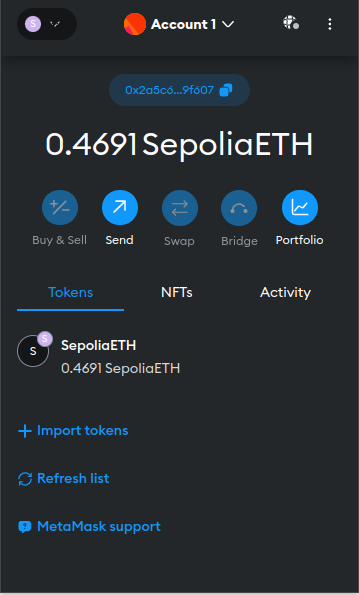
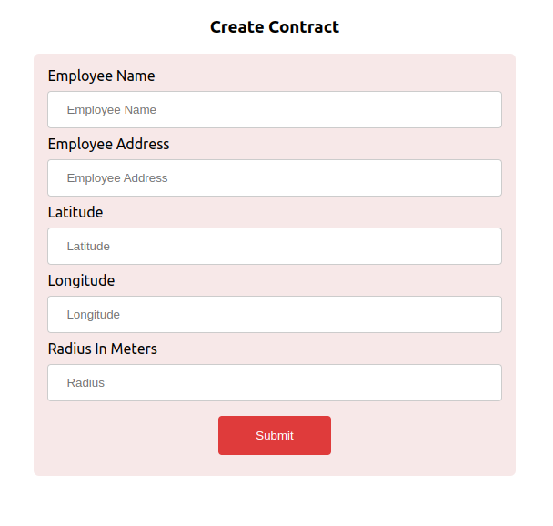

# Refund by Location Smart Contract

## Introduction

GeoLogix Solutions addresses logistics challenges by automating payments based on compliance, improving efficiency. GPS tracking ensures deliveries stay on track, enhancing reliability and customer satisfaction. Blockchain integration boosts transparency, fostering trust. By rewarding drivers, GeoLogix cultivates accountability and performance, meeting demands for tech-driven, efficient logistics solutions.

## Setting up MetaMask Wallet

To use MetaMask wallet:

- Install MetaMask extension on the desired web browser.
- Setup Account and Test network (in this project, Rinkeby test network is used)
- Load funds into Rinkeby account address by using crypto faucets.



## Admin page

The admin page serves as a platform where the employer initiates the creation of the smart contract and subsequently deploys it onto the blockchain.



### <a name='react-native  App Installation guide'></a> react-native App Installation guide


```bash
git clone https://github.com/abrhamadddis/Refund-by-Location-Smart-Contract
cd Refund-by-Location-Smart-Contract
cd mobile-application
npx expo start

```

### <a name='admin page Installation guide'></a>admin page Installation guide


```bash
git clone https://github.com/abrhamadddis/Refund-by-Location-Smart-Contract
cd Refund-by-Location-Smart-Contract
cd admin-page
npm start

```


